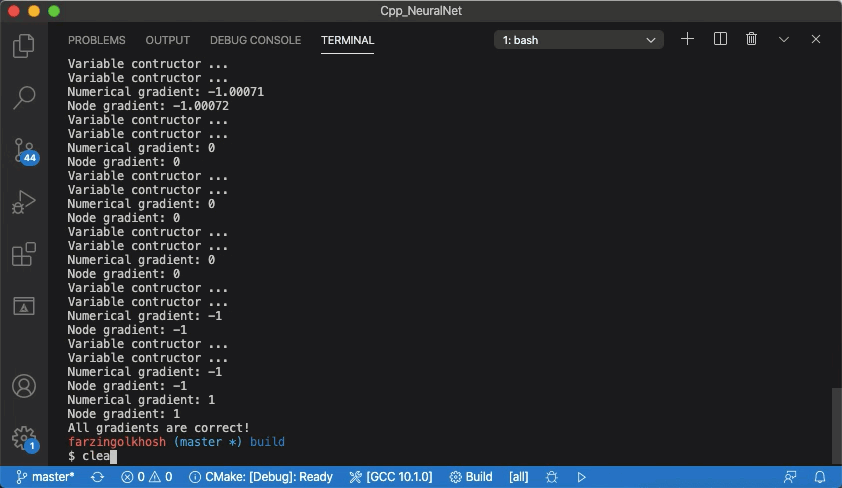

# EigenFlow
This project was inspired by Deep Learning From Scratch: Theory and Implementation [blog post](https://www.deepideas.net/deep-learning-from-scratch-theory-and-implementation/) by Daniel Sabinasz. This project implements an API to create computational graphs and neural nets using Eigen libraray in C++ from scratch. Currently it includes a gradient descent optimizer to minimize any user defined loss function. This project was created with educational purposes in mind and does not offer the most efficient way of implementing neural nets. It currently uses dynamicly sized matrices everywhere. However, for large matrices the overhead might be reasonable and still efficient according to Eigen library documentation.

## Dependencies for Running 
* cmake >= 2.8
  * All OSes: [click here for installation instructions](https://cmake.org/install/)
* make >= 4.1 (Linux, Mac), 3.81 (Windows)
  * Linux: make is installed by default on most Linux distros
  * Mac: [install Xcode command line tools to get make](https://developer.apple.com/xcode/features/)
  * Windows: [Click here for installation instructions](http://gnuwin32.sourceforge.net/packages/make.htm)
* OpenCV >= 4.1 - Not currently used
  * The OpenCV 4.1.0 source code can be found [here](https://github.com/opencv/opencv/tree/4.1.0)
* gcc/g++ >= 5.4
  * Linux: gcc / g++ is installed by default on most Linux distros
  * Mac: same deal as make - [install Xcode command line tools](https://developer.apple.com/xcode/features/)
  * Windows: recommend using [MinGW](http://www.mingw.org/)
* Eigen3 >= 3.3
    * All Oses: [download and extract Eigen's source code](http://eigen.tuxfamily.org/index.php?title=Main_Page#Download). 
    * The directory in which you placed Eigen's source code must be in the include path
    * Or use the -I option with GCC to achieve:
     ``` g++ -I /path/to/eigen/ my_program.cpp -o my_program ```

## Basic Build Instructions
1. Clone this repo.
2. Make a build directory in the top level directory: `mkdir build && cd build`
3. Compile: `cmake .. && make`
4. Run it: `./nn`.

## How to Use: 

Explanation of the example in main.cpp

Create an alias for the dynamic eigen matrix type
```typedef Eigen::Matrix<long double, Eigen::Dynamic, Eigen::Dynamic> matxxf;```

Include the NN.h in your file:
``` #include "../include/NN.h" ```

Then initialize a neural network NN class:
``` NN nn = NN(); ```

Define the number of steps for optimization
``` int const STEPS = 10000; ```

Use nn.spaceholders for constants and nn.variables for learnable variables, see the main.cpp for example:

(Use ```long double``` if you want to check the gradient calculations numerically.)

```cpp 
// matrix of scalar 1
Eigen::Matrix<long double, 1, 1> One;
One << 1; 

// cast to dynamic matrix
matxxf n = One;
BaseNode *one = nn.placeholder<long double>("one");

// Bias (m*1)
Eigen::Matrix<long double, 1, 1> B;
B << 0.1;
BaseNode *b = nn.variable<long double>(std::move(B));
    
// Wieghts (nh*nx)
Eigen::Matrix<long double, 1, 2> W;
W << 0.1, 0.2;
BaseNode *w = nn.variable<long double>(std::move(W));

// Training Data (nx*m)
Eigen::Matrix<long double, 2, 1> X;
X << 3, 2;
// cast to dynamic matrix
matxxf x = X;

// Labels (1*m)
Eigen::Matrix<long double, 1, 1> Y;
Y << 1;
// cast to dynamic matrix
matxxf yy = Y;
BaseNode *y = nn.placeholder<long double>("Y");
```
Create the activation function:
```cpp
// activation unit sigmoid(w^T*x+b) (nh*m)
BaseNode *a = nn.sigmoid<long double>(nn.add<long double>(nn.matmultiply<long double>(w, nn.placeholder<long double>("X")), b));
```

Create the loss function:
```cpp
// intermidiate loss function
// create loss function -(y*log(a)+(1-y)*log(1-a))
BaseNode *L = nn.negative<long double>(nn.add<long double>(nn.matmultiply<long double>(y, nn.log<long double>(a)), nn.matmultiply<long double>(nn.add<long double>(one, nn.negative<long double>(y)), nn.log<long double>(nn.add<long double>(one, nn.negative<long double>(a))))));
```
 
Create optimization operation:
```cpp
 // Create gradient descent optimization
    auto opt = GradientDescentOptimizer(0.01).minimize<matxxf>(L);
```

Create an unordered_map to feed the data for placeholders:
```cpp
// Create a map to feed data to the placeholders (i.e. "X" = X)
    std::unordered_map<std::string, matxxf *>
        feed = {};
    feed["X"] = &x;
    feed["Y"] = &yy;
    feed["one"] = &n;
```
Use nn.run to run the operations:
```cpp
// Run  operation
nn.run<long double>(L, feed);
```

Create a loop for optimizaiton and run optimization oprations
```cpp
for (int i = 1; i < STEPS; i++)
    {
        nn.run<long double>(&opt, feed);
        nn.run<long double>(L, feed);
        if (i % 1000 == 0)
        {
            std::cout << "Step " << i << std::endl;
            std::cout << "Activation: " << *(a->getValue<matxxf>()) << std::endl;
            std::cout << "loss: " << *(L->getValue<matxxf>()) << std::endl;
            std::cout << "Weights: " << *(w->getValue<matxxf>()) << std::endl;
            std::cout << "Bias: " << *(b->getValue<matxxf>()) << std::endl;
        }
    }
```

Use nn.checkAllGradient() to see if the gradient calculations are correct. It compares the gradients with numerically obtained values. For best results make sure the learning rate is set to zero. See the implementaiton for further information:
```cpp
 /* Check gradients -- Make sure to set learning rate to zero befor checking!! -- */
    nn.checkAllGradient(L, feed);
```

## Expected Output

